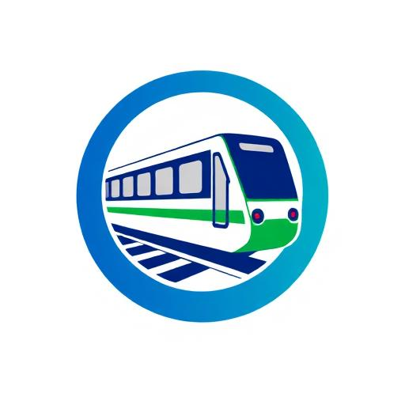

# 🚇 KMRL Document Intelligence System

A comprehensive AI-powered document summarization and intelligence system built for **Kochi Metro Rail Limited (KMRL)**. This system provides role-based dashboards for different departments with specialized document management, compliance tracking, and analytics capabilities.



## 🌟 Features

### 🔐 **Role-Based Authentication**
- Secure department-based login system
- User session management
- Role-specific dashboard routing

### 📊 **Department Dashboards**
- **Admin**: System overview, user management, and administrative controls
- **Finance & Procurement**: Financial metrics, vendor management, budget tracking
- **HR & Training**: Employee management, training tracking, compliance monitoring
- **Environmental & Regulatory**: Environmental metrics, compliance documents, AI risk analysis
- **Engineering & Safety**: Technical documentation, safety protocols, incident tracking
- **Manager**: Daily briefs, task management, team oversight
- **Executives & Legal**: Executive summaries, legal document management

### 🤖 **AI-Powered Features**
- Document summarization and intelligence
- Predictive risk analysis for environmental compliance
- Automated compliance alerts and deadline tracking
- Smart document categorization and search

### 📱 **Modern UI/UX**
- Responsive design optimized for all devices
- Professional dashboard layouts with shadcn/ui components
- Real-time data visualization and analytics
- Intuitive navigation with role-specific menus

## 🛠️ Technology Stack

- **Frontend**: React 18 + TypeScript
- **Build Tool**: Vite
- **UI Framework**: Tailwind CSS + shadcn/ui
- **Routing**: React Router v6
- **State Management**: React Query (TanStack Query)
- **Icons**: Lucide React
- **Deployment**: Ready for Vercel/Netlify

## 🚀 Getting Started

### Prerequisites

- Node.js (v18 or higher)
- npm or yarn package manager

### Installation

1. **Clone the repository**
   ```bash
   git clone https://github.com/yourusername/kmrl-document-intelligence.git
   cd kmrl-document-intelligence
   ```

2. **Install dependencies**
   ```bash
   npm install
   ```

3. **Start development server**
   ```bash
   npm run dev
   ```

4. **Open your browser**
   ```
   http://localhost:8080
   ```

## 🔑 Demo Credentials

For testing purposes, use these demo credentials:

| Department | Email | Password |
|------------|-------|----------|
| Admin | admin@kmrl.com | admin123 |
| Engineering & Safety | engineer@kmrl.com | eng123 |
| Finance & Procurement | finance@kmrl.com | fin123 |
| HR & Training | hr@kmrl.com | hr123 |
| Environmental | env@kmrl.com | env123 |
| Executives & Legal | exec@kmrl.com | exec123 |
| Frontline Manager | manager@kmrl.com | mgr123 |

## 📁 Project Structure

```
src/
├── components/          # Reusable UI components
│   ├── dashboard/       # Dashboard-specific components
│   ├── layout/          # Layout components (Header, Sidebar)
│   └── ui/             # shadcn/ui components
├── pages/              # Main pages and routes
│   ├── roles/          # Role-specific dashboards
│   ├── finance/        # Finance department pages
│   ├── hr/             # HR department pages
│   ├── environmental/  # Environmental department pages
│   └── manager/        # Manager pages
├── hooks/              # Custom React hooks
├── lib/                # Utility functions and configurations
└── assets/             # Static assets (images, icons)
```

## 🎯 Key Pages by Role

### 👨‍💼 Admin
- Dashboard (System Overview)
- Document Management
- User & Role Management
- System Analytics

### 💰 Finance & Procurement
- Financial Dashboard
- Vendor Management  
- Budget vs Actuals
- Procurement Compliance

### 👥 HR & Training
- HR Dashboard
- Employee Training Tracker
- HR Document Inbox
- Compliance Alerts

### 🌿 Environmental & Regulatory
- Environmental Metrics Dashboard
- Compliance Documents Management
- Regulatory Watch & Updates
- AI Risk Analysis

### 🔧 Engineering & Safety
- Technical Documentation
- Safety Protocols
- Incident Management
- Equipment Tracking

### 📈 Manager
- Daily Briefs
- Task Management
- Team Performance
- Quick Search & Actions

## 🚀 Deployment

### Build for Production

```bash
npm run build
```

### Deploy to Vercel

1. Push your code to GitHub
2. Connect your repository to Vercel
3. Deploy with one click

### Deploy to Netlify

1. Build the project: `npm run build`
2. Upload the `dist` folder to Netlify
3. Configure redirects for SPA routing

## 🤝 Contributing

1. Fork the repository
2. Create a feature branch (`git checkout -b feature/amazing-feature`)
3. Commit your changes (`git commit -m 'Add some amazing feature'`)
4. Push to the branch (`git push origin feature/amazing-feature`)
5. Open a Pull Request

## 📄 License

This project is licensed under the MIT License - see the [LICENSE](LICENSE) file for details.

## 📧 Contact

**Kochi Metro Rail Limited (KMRL)**
- Website: [https://www.kochimetro.org](https://www.kochimetro.org)
- Email: info@kmrl.co.in

## 🙏 Acknowledgments

- Built with React and modern web technologies
- UI components powered by shadcn/ui
- Icons by Lucide React
- Developed for digital transformation of document management at KMRL

---

**⚡ Made with ❤️ for Kochi Metro Rail Limited**